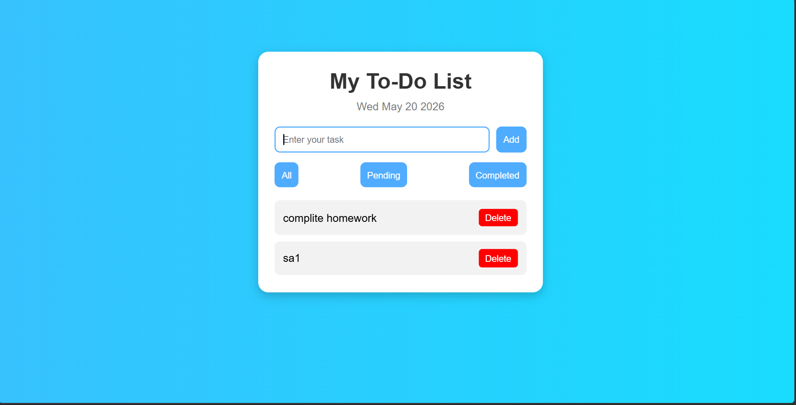

# Ex03 To-Do List using JavaScript
## Date:20.5.2026

## AIM
To create a To-do Application with all features using JavaScript.

## ALGORITHM
### STEP 1
Build the HTML structure (index.html).

### STEP 2
Style the App (style.css).

### STEP 3
Plan the features the To-Do App should have.

### STEP 4
Create a To-do application using Javascript.

### STEP 5
Add functionalities.

### STEP 6
Test the App.

### STEP 7
Open the HTML file in a browser to check layout and functionality.

### STEP 8
Fix styling issues and refine content placement.

### STEP 9
Deploy the website.

### STEP 10
Upload to GitHub Pages for free hosting.

## PROGRAM
```
<!DOCTYPE html>
<html>
<head>
    <title>Advanced To-Do List</title>
    <link rel="stylesheet" href="style.css">
</head>
<body>

    <div class="todo-container">

        <h1>My To-Do List</h1>

        <p id="date"></p>

        <div class="input-section">
            <input type="text" id="taskInput" placeholder="Enter your task">
            <button onclick="addTask()">Add</button>
        </div>

        <div class="filter-section">
            <button onclick="filterTasks('all')">All</button>
            <button onclick="filterTasks('pending')">Pending</button>
            <button onclick="filterTasks('completed')">Completed</button>
        </div>

        <ul id="taskList"></ul>

    </div>

    <script src="script.js"></script>
</body>
</html>


*{
    margin:0;
    padding:0;
    box-sizing:border-box;
}

body{
    font-family:Arial, sans-serif;
    background:linear-gradient(to right,#4facfe,#00f2fe);
    height:100vh;
    display:flex;
    justify-content:center;
    align-items:center;
}

.todo-container{
    width:420px;
    background:white;
    padding:25px;
    border-radius:15px;
    box-shadow:0 5px 15px rgba(0,0,0,0.2);
}

h1{
    text-align:center;
    margin-bottom:10px;
    color:#333;
}

#date{
    text-align:center;
    margin-bottom:20px;
    color:gray;
}

.input-section{
    display:flex;
    gap:10px;
}

input{
    flex:1;
    padding:10px;
    border:2px solid #4facfe;
    border-radius:8px;
    outline:none;
}

button{
    padding:10px;
    border:none;
    border-radius:8px;
    background:#4facfe;
    color:white;
    cursor:pointer;
    transition:0.3s;
}

button:hover{
    background:#007bff;
}

.filter-section{
    display:flex;
    justify-content:space-between;
    margin-top:15px;
}

ul{
    margin-top:20px;
}

li{
    list-style:none;
    background:#f2f2f2;
    margin-top:10px;
    padding:12px;
    border-radius:8px;
    display:flex;
    justify-content:space-between;
    align-items:center;
}

.completed{
    text-decoration:line-through;
    color:gray;
}

.delete-btn{
    background:red;
    padding:5px 10px;
    border-radius:5px;
}

.delete-btn:hover{
    background:darkred;
}


// Show Current Date
let today = new Date();

document.getElementById("date").innerHTML =
today.toDateString();

function addTask(){

    let input = document.getElementById("taskInput");

    let task = input.value.trim();

    if(task === ""){
        alert("Please enter a task");
        return;
    }

    let li = document.createElement("li");

    let taskText = document.createElement("span");

    taskText.textContent = task;

    taskText.onclick = function(){
        taskText.classList.toggle("completed");
    };

    let deleteBtn = document.createElement("button");

    deleteBtn.textContent = "Delete";

    deleteBtn.classList.add("delete-btn");

    deleteBtn.onclick = function(){
        li.remove();
    };

    li.appendChild(taskText);

    li.appendChild(deleteBtn);

    document.getElementById("taskList").appendChild(li);

    input.value = "";
}

// Filter Function
function filterTasks(type){

    let tasks = document.querySelectorAll("#taskList li");

    tasks.forEach(function(task){

        let text = task.querySelector("span");

        if(type === "all"){
            task.style.display = "flex";
        }

        else if(type === "completed"){

            if(text.classList.contains("completed")){
                task.style.display = "flex";
            }
            else{
                task.style.display = "none";
            }
        }

        else if(type === "pending"){

            if(!text.classList.contains("completed")){
                task.style.display = "flex";
            }
            else{
                task.style.display = "none";
            }
        }

    });
}

```

## OUTPUT


## RESULT
The program for creating To-do list using JavaScript is executed successfully.
